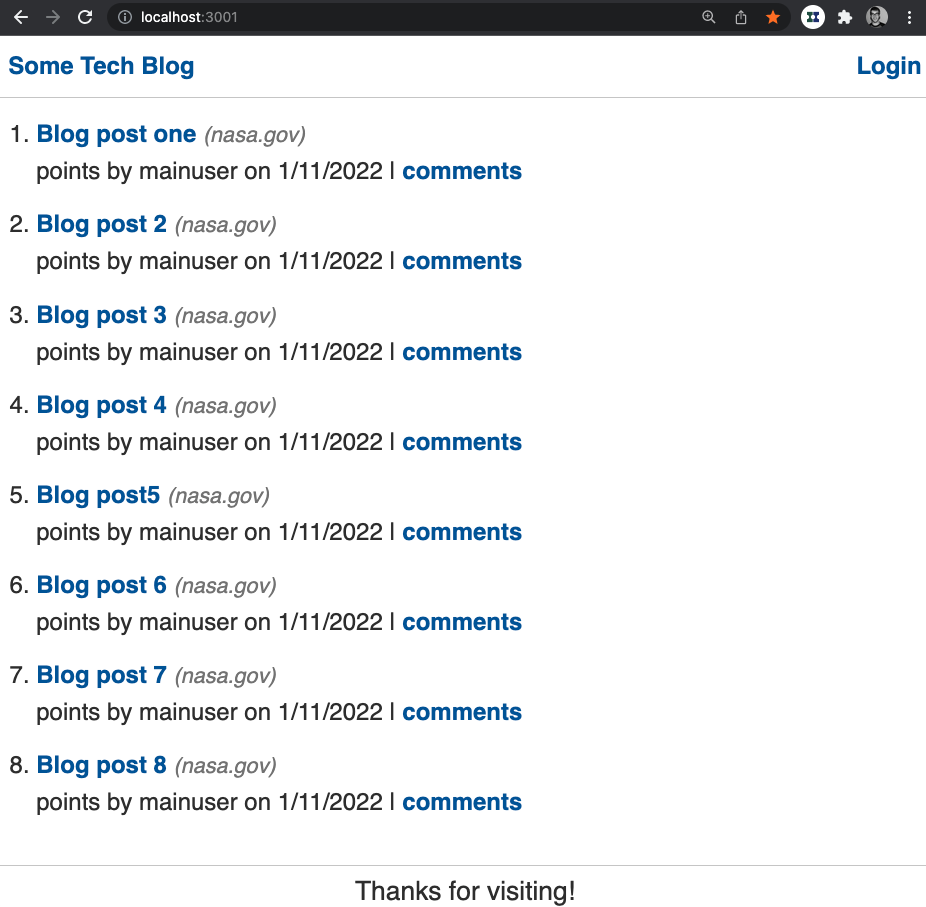

# mvcMockblog
mock blog app using mvc

## Description

Mock blog using Sequelize 

## Node Packages
* express
* express-handlebars
* express-session
* sequelize
* connect-session-sequelize
* mysql2
* dotenv
* bcrypt

`npm i` 

## Create DB

cd db
mysql -u USERNAME -p 
source schema.sql

### populate db

`npm run seeds`

## deploy

Deply the app to heroku.
`git push heroku main`

## Deployment 
[link to heroku app](https://mvc-mock-blog.herokuapp.com/)

## Example

